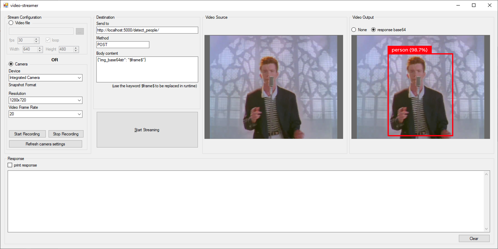

# LoDeTo - Local Development Tool for Computer Vision Modules

This tool intends to facilitate the development process of Computer Vision modules for the ABB Ability System 800xA Camera Connect library.

## What is Camera Connect?

Camera Connect is an extension of the 800xA System that allows the integration of cameras (and other devices) on the 800xA System, allowing the usage of it for multiple purposes, such as surveilance, process control, process optimization, etc.

Camera Connect also allows the development of video analytics and the LoDeTo tool intends to support this development.

More info about the Camera Connect library [here](https://share.library.abb.com/api/v4?cid=Root&q=4hzm0000).

## What is this tool?

This is a simple Windows application that allows the user to develop video analytics on his/her local computer, reducing the effort of configuring an 800xA System to do that.



*The image above shows the usage of LoDeTo to develop a Computer Vision module to identify and extract the color of a Rubik's cube.*

## How to use

Once you've cloned this repository, open the solution and open the `MainWindows.cs` file.

Every frame received from the camera is available through the variable `bitmap` on method `FinalFrame_NewFrame`. Manipulate this *bitmap* variable as you wish and then uncomment line 78 and use it to plot the manipulated image.

```c#
using (var bitmap = (Bitmap) eventArgs.Frame.Clone())
{
    cameraOriginal.Image = (Bitmap)bitmap.Clone();
    //cameraImageBox.Image = <INSERT HERE THE BITMAP TO PLOT ON THE BIG IMAGE BOX>; <<<<<<
}
```

**Example:**

```c#
using (var bitmap = (Bitmap) eventArgs.Frame.Clone())
{
    cameraOriginal.Image = (Bitmap)bitmap.Clone();
    cameraImageBox.Image = my_module.IdentifyCubelets(bitmap);
}
```

### Contact

If you need some help mail us: global-camera.connect.support@abb.com

### References

[1] Original project: [WebcamApp](https://github.com/katarzynaB99/WebcamApp) from *katarzynaB99*